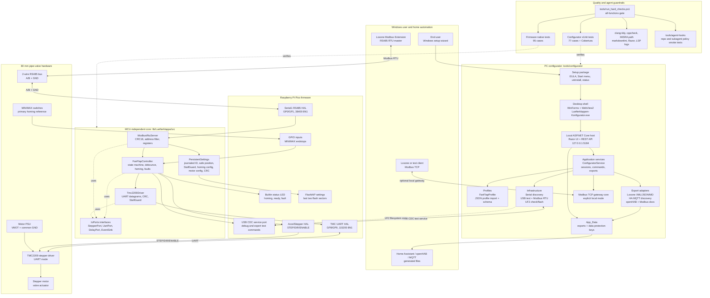
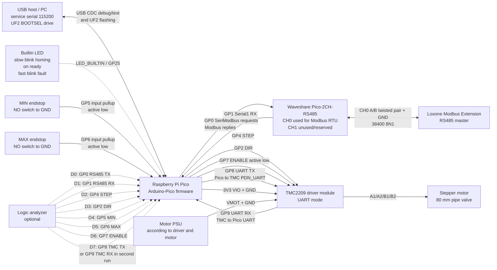

# Luefterklappensteuerung

MCU-unabhaengige Steuerlogik fuer ein 80-mm-Rohrventil mit Schrittmotor,
TMC2209-UART, RS485/Modbus RTU und zwei Endschaltern. Die eigentliche
State-Machine liegt in einem portablen Core; `src/main.cpp` ist nur die
Raspberry-Pi-Pico/Arduino-HAL.

## Funktionsliste

- Portable C++14-Core-Logik ohne Arduino-Abhaengigkeit.
- Homing gegen Min-/Max-Endschalter mit Plausibilitaetspruefung und
  StallGuard-Redundanz, wenn ein Endschalter nicht ausloest.
- Soft-Endstops und Zielpositionen in Steps, `0..1000` Promille oder
  `0..90` Grad; `0` Grad ist offen/waagrecht, `90` Grad geschlossen/senkrecht.
- Safe-Position in Promille; nach gueltigem Homing faehrt die Klappe in diese
  definierte Lueftungsstellung.
- Debounced Endschalter und Boot-Plausibilitaet gegen beide gleichzeitig
  aktive Endlagen.
- Fehlerzustand mit stabilem Fehlergrund, Fault-Counter, No-Progress-Timeout,
  TMC-Kommunikationsfehler und StallGuard waehrend normaler Bewegung.
- Reset-Timeout mit automatischem Re-Homing.
- TMC2209-UART mit Datagramm-CRC, Konfiguration und einstellbarer
  StallGuard-Abfrage.
- Modbus-RTU-Slave fuer Loxone/Home-Automation auf RS485.
- Geraete-ID `1..247`, Safe-Position und StallGuard-Schwelle werden im
  Pico-Flash ueber zwei physische Sektoren journalisiert und mit CRC persistiert.
- Altes adressiertes Textprotokoll als Service-/Debugpfad.
- Native Unit-Tests mit Fake-Stepper, Fake-UART, Fake-Zeit und Fake-Events.
- clang-tidy, cppcheck und MISRA-Addon-Checks ueber das Quality-Skript.
- sigrok-cli Logic-Analyzer-Testpfad fuer Modbus, TMC-UART und STEP-Timing.
- Lokaler C# Konfigurator unter `tools/configurator` mit Loxone Setup Wizard,
  Exporte, JSON-Profile, UF2-Flashing, Logo/Icon-Paket und Modbus-TCP-Gateway.
- Mermaid-Architektur- und Wiring-Diagramme im README und als `docs/diagrams/*.mmd`.
- Pico-Onboard-LED als Statusanzeige: Homing blinkt langsam, Ready leuchtet,
  Fehler blinkt schnell.
- Firmware-Acceptance-Skript mit No-Hardware-, Hardware- und optionalem
  Logic-Analyzer-Modus.

## Schnellstart nach dem Klonen

Auf einem frischen Windows-PC sind diese Werkzeuge erwartet:

- Git, PowerShell und Visual Studio oder VS Code.
- .NET 8 SDK. Alternativ ein lokales SDK unter `%USERPROFILE%\.dotnet8`.
- Python 3.12 oder 3.11 mit PlatformIO.
- MSYS2 unter `C:\msys64` mit `mingw-w64-x86_64-nodejs`,
  `mingw-w64-x86_64-cppcheck` und `mingw-w64-x86_64-clang-tools-extra`.
- WebView2 Runtime fuer die Windows-App. Auf aktuellen Windows-Installationen
  ist sie normalerweise vorhanden.

Clone und Bootstrap:

```powershell
git clone https://github.com/Mosei1984/L-fterklappensteuerung.git
cd .\L-fterklappensteuerung

$pythonScripts = Join-Path $env:LOCALAPPDATA 'Programs\Python\Python312\Scripts'
$env:PATH = "C:\msys64\mingw64\bin;C:\msys64\usr\bin;$pythonScripts;$env:PATH"
$env:PLATFORMIO_CORE_DIR = 'C:\pio-luefter'
New-Item -ItemType Directory -Force -Path .\.dotnet-cli-home, .\.nuget | Out-Null
$env:DOTNET_CLI_HOME = (Resolve-Path .\.dotnet-cli-home).Path
$env:NUGET_PACKAGES = (Resolve-Path .\.nuget).Path
python -m pip install --upgrade pip platformio
npm install
dotnet restore .\tools\configurator\LuefterConfigurator.sln --ignore-failed-sources -p:NuGetAudit=false
powershell -ExecutionPolicy Bypass -File .\tools\run_quality_checks.ps1
```

Neue Agenten sollen zuerst `AGENTS.md` lesen. Dort stehen Arbeitsbereiche,
Guardrails, Gate-Befehle, Release-Abnahme und Git-Regeln kompakt zusammen.
Visual Studio oeffnet die Loesung `tools/configurator/LuefterConfigurator.sln`;
Firmware-Builds laufen ueber PlatformIO aus dem Repository-Root.

## Architektur



### Komponenten

| Pfad | Aufgabe |
| --- | --- |
| `lib/Luefterklappe/src/IoPorts.h` | MCU-unabhaengige Ports fuer Stepper, UART, Delay und Events |
| `lib/Luefterklappe/src/FaultReason.h` | Stabile Fehlercodes fuer Modbus, Textdiagnose und Tests |
| `lib/Luefterklappe/src/InputDebouncer.*` | MCU-unabhaengiges Entprellen und Boot-Sanity fuer Endschalter |
| `lib/Luefterklappe/src/FanFlapController.*` | State-Machine, Homing, Softlimits, Fehlerbehandlung, Textbefehle |
| `lib/Luefterklappe/src/Tmc2209Driver.*` | TMC2209-UART-Datagramme, CRC, Konfiguration, StallGuard |
| `lib/Luefterklappe/src/ModbusRtuServer.*` | Modbus-RTU-Slave, Registermap, CRC16, Exception Responses |
| `lib/Luefterklappe/src/PersistentSettings.*` | Persistente ID/Safe-Position/StallGuard-Schwelle/Homing-/Motor-Konfiguration mit Dual-Sektor-Journal, Magic, Version und CRC |
| `src/main.cpp` | Pico/Arduino-HAL, Pinning, Serial1 RS485, TMC-UART, GPIO, Flash, Watchdog und LED |
| `test/test_controller/test_main.cpp` | Native Unit-Tests fuer Core, Modbus und TMC |
| `tools/la/` | sigrok-cli Capture, Decode und Offline-Analyse |
| `tools/firmware_release_check.ps1` | Firmware-Acceptance mit Hard-Gate, UF2-Hash, Serial/Modbus und optionaler LA-Pruefung |
| `tools/configurator/src/LuefterConfigurator.Desktop` | Windows-Fenster mit WebView2, startet den lokalen Host unsichtbar |
| `tools/configurator/src/LuefterConfigurator.Host` | ASP.NET-Core/Razor-UI und lokale REST-API |
| `tools/configurator/src/LuefterConfigurator.Application` | Controller-Scan, Config-State, Befehle, Gateway- und Exportkoordination |
| `tools/configurator/src/LuefterConfigurator.Adapters.*` | Loxone, Home Assistant, openHAB und generische Modbus-Exporte |
| `tools/configurator/src/LuefterConfigurator.Infrastructure.*` | Serial/USB, UF2-Firmwarepfad, Modbus-TCP-Frame/Gateway |
| `tools/run_hard_checks.ps1` | Gesamter Qualitaetslauf mit Coverage, Razor, Markdown, LSP-Logs und Hook-Smoke |
| `tools/agent-hooks/` | Repo- und Subagent-Guardrails fuer sichere Agentenarbeit |
| `docs/diagrams/` | Mermaid-Quellen fuer Architektur und Wiring |

## Konfigurator

Der PC-Konfigurator ist das primaere Windows-Service-Tool fuer die
Inbetriebnahme des 80-mm-Rohrventils. Normale Nutzer starten
`Luefterklappen-Konfigurator.exe`; die App oeffnet ein eigenes Windows-Fenster
und fuehrt zuerst durch den **Loxone Setup Wizard**:

1. Loxone/Modbus-TCP-Daten vorbereiten.
2. Pico ueber USB erkennen.
3. UF2-Firmware pruefen und flashen.
4. Controller-ID, Safe-Position, Grad-Limits und StallGuard-Schwelle schreiben.
5. Loxone XML, JSON-Konfig und Markdown-Doku erzeugen und herunterladen.
6. Abschlusscheck fuer Statusregister und Gateway durchlaufen.

USB Host Test, Rohbefehle und Gateway-Diagnose bleiben in einer getrennten
Expertentest-Spalte. Der lokale Host laeuft intern im Hintergrund; direkter
Browserzugriff auf `http://127.0.0.1:5184` ist nur fuer Entwicklung und
Expertentests vorgesehen.

Expert-Host aus dem Quellbaum starten:

```powershell
New-Item -ItemType Directory -Force -Path .\.dotnet-cli-home | Out-Null
$env:DOTNET_CLI_HOME=(Resolve-Path .\.dotnet-cli-home).Path
dotnet run --project .\tools\configurator\src\LuefterConfigurator.Host
```

Windows Installation bauen:

```powershell
powershell -ExecutionPolicy Bypass -File .\tools\configurator\build-windows-installer.ps1
```

Das Paket liegt danach unter:

```text
artifacts/configurator-installer/win-x64/Luefterklappen-Konfigurator-win-x64.zip
```

Nach dem Entpacken startet `Luefterklappen-Konfigurator-Setup.cmd` den
interaktiven Windows-Setup-Wizard mit EULA-Bestaetigung, Installationspfad,
Desktop-Verknuepfung und optionalem Start nach der Installation. Die
Deinstallation laeuft ueber Apps & Features oder den Startmenueeintrag
`Luefterklappen Konfigurator deinstallieren`.

## Komplettes Wiring



### Pin-Tabelle

| Pico Pin | Richtung | Verbindung | Pegel/Protokoll | Hinweis |
| --- | --- | --- | --- | --- |
| `GP0` | TX | Waveshare RS485 CH0 TX/DI | UART `38400 8N1` | `Serial1 TX`, Modbus-Antworten |
| `GP1` | RX | Waveshare RS485 CH0 RX/RO | UART `38400 8N1` | `Serial1 RX`, Modbus-Anfragen |
| `GP2` | OUT | TMC2209 `DIR` | 3.3 V digital | AccelStepper DIR |
| `GP4` | OUT | TMC2209 `STEP` | 3.3 V digital | AccelStepper STEP |
| `GP5` | IN | Min-Endschalter nach GND | `INPUT_PULLUP`, aktiv LOW | Firmware erwartet NO-Schalter nach GND |
| `GP6` | IN | Max-Endschalter nach GND | `INPUT_PULLUP`, aktiv LOW | Firmware erwartet NO-Schalter nach GND |
| `GP7` | OUT | TMC2209 `EN`/`ENABLE` | aktiv LOW | LOW = Treiber aktiv |
| `GP8` | TX | TMC2209 `PDN_UART`/UART RX | UART `115200 8N1` | Pico -> TMC, typ. ueber 1 kOhm |
| `GP9` | RX | TMC2209 `PDN_UART`/UART TX | UART `115200 8N1` | TMC -> Pico; bei 1-Draht-UART gleiche Leitung |
| `3V3` | PWR | TMC2209 `VIO` | 3.3 V | Nur Logikversorgung, nicht Motorversorgung |
| `GND` | PWR | RS485, TMC, Endschalter, PSU, LA | gemeinsame Masse | Pflicht fuer stabile Kommunikation |
| `USB` | I/O | PC/Service | CDC Serial `115200` | Debug-Events und Servicebefehle |
| `LED_BUILTIN` | OUT | Pico-Onboard-LED | Status | Homing langsam blinkend, Ready an, Fehler schnell blinkend |

### Feldbus und Versorgung

- RS485 A/B als verdrillte Leitung fuehren; GND mitfuehren.
- Abschlusswiderstand nur an den zwei physischen Busenden setzen.
- Bias/Failsafe nur einmal am Bus, falls Master/Modul das nicht bereits stellt.
- Wenn Modbus nicht antwortet, zuerst A/B tauschen und GND pruefen.
- Motorversorgung `VMOT` passend zu Motor und TMC-Modul auslegen.
- TMC2209-Stromlimit am Modul korrekt einstellen; Firmware ersetzt keine
  elektrische Strombegrenzung.
- Endschalter sind aktuell als NO-Schalter nach GND vorgesehen. Fuer NC-
  Sicherheitsschalter muss die HAL-Logik angepasst oder extern invertiert werden.
- RS485 A/B nicht direkt mit einem 3.3-V-Logic-Analyzer messen. Fuer UART-
  Decoding an GP0/GP1 bzw. DI/RO messen.
- Auf dem Waveshare Pico-2CH-RS485 wird aktuell nur CH0 verwendet. CH1 bleibt
  frei/reserviert und ist kein automatischer Repeater fuer den Modbus-Bus.

### BTT TMC2209 V1.3

Der verlinkte BIGTREETECH/BTT TMC2209 V1.3 passt zum vorgesehenen UART-Modus.
Die Firmware nutzt weiterhin STEP/DIR fuer die Bewegung und UART fuer
Konfiguration/Diagnose/StallGuard. Praktische Punkte fuer dieses Modul:

- `EN` ist aktiv LOW; in der Firmware ist `GP7` entsprechend aktiv LOW.
- `PDN_UART` ist die UART-Leitung. Bei Ein-Draht-UART `GP8` ueber etwa `1 kOhm`
  auf `PDN_UART` fuehren und `GP9` an dieselbe Leitung bzw. an den UART-Ausgang
  des Moduls, falls das Carrier-Board TX/RX trennt.
- `VIO` an `3V3`, `GND` gemeinsam mit Pico, RS485 und Motorversorgung.
- Kuehlkoerper montieren und Motorstrom/Vref am Modul passend zum Motor setzen.
  Firmware-UART ersetzt keine elektrische Strombegrenzung.
- StallGuard4 ist als Zusatzdiagnose aktiv. Die Schwelle ist ueber
  `STALLGUARD <0..255>` bzw. Register `27` einstellbar; mechanische
  Endschalter bleiben in dieser Steuerung die primaere Referenz fuer
  Home-Betrieb.

## Safe-Zustand fuer Wohnraumlueftung

This controller is a comfort/home-automation fan-flap controller for an 80-mm
pipe valve. It is not a fire damper, smoke damper, CO detector, combustion
appliance safety device or life-safety product. Smoke alarms, CO alarms,
combustion-appliance maintenance and building-level ventilation planning remain
separate requirements.

Normative Quellen fuer Wohnraumlueftung fordern keine pauschale "Klappe zu"-
Fehlerstellung. Die sicherere Firmware-Annahme ist: Luftwechsel erhalten, aber
keine Kraft gegen eine Blockade aufbauen. Deshalb gilt:

- Nach gueltigem Homing faehrt die Steuerung die konfigurierbare Safe-Position
  an. Default ist `1000` Promille, also offen.
- Im Fehlerfall stoppt der Motor, der Treiber wird deaktiviert. Danach ist
  `REFRESH` der bevorzugte Weg: Fehler quittieren, Maschine neu referenzieren,
  aber MCU/Pico nicht neu booten. `RESET` bleibt als Kompatibilitaetsbefehl
  erhalten.
- StallGuard wird beim Homing nur redundant benutzt: Wenn der jeweilige
  Endschalter nicht ausloest, darf StallGuard die mechanische Endlage erkennen.
- Bei normaler Bewegung und beim kurzen Wegfahr-Free-Check bedeutet StallGuard
  Blockade/Ueberlast und fuehrt in den Fehlerzustand.

Hintergrundquellen:

- DIN FAQ zur `DIN 1946-6:2019-12`:
  <https://www.din.de/de/service-fuer-anwender/normungsportale/normungsportal-klima-und-lueftungstechnik/faqs-zur-din-1946-6-2019-12-901724>
- BMUKN/UBA zu richtigem Lueften und Schimmelvermeidung:
  <https://www.bundesumweltministerium.de/themen/gesundheit/innenraumluft/richtiges-lueften-und-heizen>
- US EPA zu Wohnraumlueftung und ASHRAE 62.2:
  <https://www.epa.gov/indoor-air-quality-iaq/how-much-ventilation-do-i-need-my-home-improve-indoor-air-quality>
- ASHRAE 62.2 Uebersicht:
  <https://www.ashrae.org/technical-resources/bookstore/standards-62-1-62-2>
- Analog Devices TMC2209-Datenblatt:
  <https://www.analog.com/media/en/technical-documentation/data-sheets/tmc2209_datasheet_rev1.09.pdf>

## RS485, Modbus und Loxone

Primaere Home-Automation-Schnittstelle ist Modbus RTU auf `Serial1`.

| Parameter | Wert |
| --- | --- |
| Rolle | Slave |
| Default-ID | `1` |
| Baudrate | `38400` |
| Datenformat | `8N1` |
| Modbus-Funktionen | `0x03`, `0x06`, `0x10` |
| Broadcast-ID `0` | wird ignoriert, keine Antwort |
| Fremde ID | wird ignoriert, keine Antwort |
| Fehlerhafte CRC | wird ignoriert |

### Holding-Register

Adressen sind 0-basiert, passend fuer Loxone Config.

| Adresse | Zugriff | Bedeutung |
| --- | --- | --- |
| 0 | R/W | Kommando: `0` none, `1` home, `2` reset, `3` soft endstops on, `4` off, `5` refresh machine |
| 1 | R/W | Zielposition Steps High Word |
| 2 | R/W | Zielposition Steps Low Word |
| 3 | R/W | Soft-Min Steps High Word |
| 4 | R/W | Soft-Min Steps Low Word |
| 5 | R/W | Soft-Max Steps High Word |
| 6 | R/W | Soft-Max Steps Low Word |
| 7 | R/W | Modbus-/Geraete-ID `1..247` |
| 8 | R | Controller-State |
| 9 | R | Flags: Bit0 ready, Bit1 fault, Bit2 soft endstops active, Bit3 moving |
| 10 | R | Istposition Steps High Word |
| 11 | R | Istposition Steps Low Word |
| 12 | R | Homing-Max Steps High Word |
| 13 | R | Homing-Max Steps Low Word |
| 14 | R/W | Zielposition `0..1000` Promille vom Homing-Weg |
| 15 | R | Istposition `0..1000` Promille vom Homing-Weg |
| 16 | R/W | Safe-Position `0..1000` Promille; wird im Flash gespeichert |
| 17 | R | Letzter Fehlergrund, siehe `FaultReason` |
| 18 | R | Fault-Counter, saettigt bei `65535` |
| 19 | R | Letzter Settings-Status: `0` unknown, `1` default, `2` loaded, `3` saved, `4` failed |
| 20 | R | TMC-Health: `0` unknown, `1` ok, `2` communication error, `3` disabled by build |
| 21 | R | Boot-Grund: `0` unknown, `1` power-on, `2` watchdog, `3` software reset |
| 22 | R | Firmware-Protokollversion, aktuell `5` |
| 23 | R/W | `target_degree`: Zielwinkel `0..90` Grad; `0` offen/waagrecht, `90` geschlossen/senkrecht |
| 24 | R | `current_degree`: Istwinkel `0..90` Grad |
| 25 | R/W | `soft_min_degree`: Soft-Min Winkel `0..90` Grad |
| 26 | R/W | `soft_max_degree`: Soft-Max Winkel `0..90` Grad |
| 27 | R/W | `stallguard_threshold`: StallGuard-Schwelle `0..255`; wird im Flash gespeichert und als TMC2209 SGTHRS geschrieben |
| 28 | R/W | `home_min_switch`: logischer Min-Endpunkt, `0` MIN-Eingang, `1` MAX-Eingang |
| 29 | R/W | `home_max_switch`: logischer Max-Endpunkt, `0` MIN-Eingang, `1` MAX-Eingang |
| 30 | R/W | `home_min_direction`: Start-Richtung fuer Min-Homing, `0` negativ, `1` positiv |
| 31 | R/W | `home_max_direction`: Start-Richtung fuer Max-Homing, `0` negativ, `1` positiv |
| 32 | R/W | `stepper_direction_inverted`: Stepper-Richtung invertieren, `0` normal, `1` invertiert |
| 33 | R/W | `normal_max_speed`: maximale Fahrgeschwindigkeit normaler Zielbewegungen in Steps/s, `20..5000` |
| 34 | R/W | `homing_max_speed`: maximale Homing-Geschwindigkeit in Steps/s, `20..5000` |
| 35 | R/W | `run_current_milliamps`: TMC2209-Laufstromlimit in mA, `100..1000`, wird per UART als `IHOLD_IRUN` geschrieben |

`FaultReason`-Werte in Register `17`:

| Wert | Bedeutung |
| --- | --- |
| 0 | kein Fehler |
| 1 | Homing-Bereich ungueltig |
| 2 | Min-Endschalter beim Homing nicht erreicht |
| 3 | Max-Endschalter beim Homing nicht erreicht |
| 4 | unerwarteter Min-Endschalter |
| 5 | unerwarteter Max-Endschalter |
| 6 | StallGuard waehrend normaler Bewegung |
| 7 | Ventil beim Wegfahr-Free-Check blockiert |
| 8 | Bewegung ohne Positionsfortschritt |
| 9 | TMC2209-UART-Kommunikation verloren |
| 10 | Settings konnten nicht geschrieben werden |
| 11 | beide Endschalter beim Boot aktiv |
| 12 | Watchdog-Neustart erkannt |

Empfohlen fuer Loxone:

- Register `23` als analoger Aktor `0..90` Grad fuer normale Bedienung.
- Optional Register `14` als Legacy-Aktor `0..1000` Promille.
- Register `16` als Parameter fuer die Safe-Position verwenden.
- Register `25`, `26` und `27` als Expertenparameter fuer Grad-Limits und
  StallGuard-Schwelle verwenden; Register `28..32` nur fuer Inbetriebnahme
  der Endschalter-/Richtungszuordnung schreiben; Register `33..35` fuer
  Speed/Strom nur nach Motor- und Mechaniktest anpassen.
- Nach dem Schreiben von Register `23` oder `14` Register `9`, `15` und `24`
  pollen:
  Bit3 `moving` bleibt gesetzt, bis die Istposition die Zielposition erreicht.
- Register `8`, `9`, `15..24` langsam pollen, z. B. alle `2..5 s`.
- Zielpositions-Schreibbefehle eventgetrieben senden, nicht dauerhaft pollen.
- Register `0` mit Wert `5` als Fehler-Rehome/Refresh-Machine-Befehl
  vorsehen, damit nach Blockade oder Endschalterfehler kein Pico-Reset noetig
  ist.
- Register `0..35` koennen in einem Holding-Register-Block gelesen werden,
  damit Loxone/Modbus-TCP-Gateways den Zustand konsistent erfassen.
- Schnelle Bewegung, Endschalter, Softlimits, StallGuard und Fehlerbehandlung
  lokal im Controller lassen.

## Service-Textprotokoll

Das alte Textprotokoll bleibt als Service-/Debugpfad erhalten. Auf RS485 werden
nur adressierte Textbefehle angenommen, damit mehrere Slaves am Bus nicht
kollidieren.
Auf USB-Serial `115200` werden dieselben Befehle auch ohne `ID<n>` akzeptiert;
adressierte Befehle funktionieren dort ebenfalls.

| Befehl | Wirkung |
| --- | --- |
| `ID<n> GOTO <steps>` | Zielposition in Steps setzen; nach Erreichen meldet der Pico `Position erreicht: Steps=<steps> Promille=<0..1000> Grad=<0..90>` |
| `ID<n> GOTO_DEG <0..90>` | Zielwinkel setzen; `0` Grad offen/waagrecht, `90` Grad geschlossen/senkrecht |
| `ID<n> POS?` | aktuelle Position melden |
| `ID<n> DEG?` | aktuelle Position in Grad melden |
| `ID<n> HOME` | Homing starten |
| `ID<n> REFRESH` | Fehler quittieren und Homing ohne MCU-Reset starten |
| `ID<n> REFRESH MACHINE` | Alias fuer `REFRESH` |
| `ID<n> RESET` | Kompatibilitaetsbefehl fuer Fehler quittieren und Homing |
| `ID<n> SOFTMIN <steps>` | Soft-Min setzen |
| `ID<n> SOFTMAX <steps>` | Soft-Max setzen |
| `ID<n> SOFTMIN_DEG <0..90>` | minimal erlaubten Winkel setzen |
| `ID<n> SOFTMAX_DEG <0..90>` | maximal erlaubten Winkel setzen |
| `ID<n> DEGLIMITS?` | Grad-Limits melden |
| `ID<n> SOFTENDSTOPS ON` | Soft-Endstops aktivieren |
| `ID<n> SOFTENDSTOPS OFF` | Soft-Endstops deaktivieren |
| `ID<n> SOFTENDSTOPS?` | Soft-Endstop-Status melden |
| `ID<n> ID?` | Geraete-ID melden |
| `ID<n> ID <1..247>` | Geraete-ID setzen |
| `ID<n> SETID <1..247>` | Alias fuer ID setzen |
| `ID<n> SAFE?` | Safe-Position in Promille melden |
| `ID<n> SAFE <0..1000>` | Safe-Position setzen und speichern |
| `ID<n> STALLGUARD?` | StallGuard-Schwelle melden |
| `ID<n> STALLGUARD <0..255>` | StallGuard-Schwelle setzen, speichern und auf SGTHRS schreiben |
| `ID<n> HOMECFG?` | Homing-Zuordnung melden: Min-Switch, Max-Switch, Min-Richtung, Max-Richtung, Stepper-Invert |
| `ID<n> HOMECFG <0\|1> <0\|1> <0\|1> <0\|1> <0\|1>` | Homing-Zuordnung setzen und speichern; unterschiedliche Switches und Richtungen sind Pflicht |
| `ID<n> MOTORCFG?` | Motorparameter melden: Normalfahrt-Speed, Homing-Speed, TMC2209-Laufstrom in mA |
| `ID<n> MOTORCFG <20..5000> <20..5000> <100..1000>` | Motor-Speed und Laufstrom setzen, speichern und per TMC-UART auf `IHOLD_IRUN` schreiben |
| `ID<n> FAULT?` | letzten Fehlergrund und Fault-Counter melden |
| `ID<n> DIAG?` | Diagnose-Snapshot mit Fehlergrund und Fault-Counter melden |
| `ID<n> SELFTEST?` | nicht-bewegenden Selbsttest mit State, ID, Safe-Position und Endschaltern melden |

Debug-/Eventtexte gehen standardmaessig auf USB `Serial`, nicht auf RS485.
Damit stoeren Homing-, Fehler- oder TMC-Meldungen keine Modbus-Kommunikation.
Nur fuer Servicebetrieb kann `LUEFTERKLAPPE_EVENTS_TO_RS485=1` gesetzt werden.

## How To

### 1. Abhaengigkeiten installieren

PlatformIO wird fuer Firmware und Tests benoetigt. Mermaid CLI und
Markdownlint sind lokale Dev-Dependencies und werden ueber `npm install`
wiederhergestellt. Der kurze PlatformIO-Core-Pfad vermeidet Windows-
Pfadlaengenprobleme mit Arduino-Mbed-Paketen.

```powershell
$pythonScripts = Join-Path $env:LOCALAPPDATA 'Programs\Python\Python312\Scripts'
$env:PATH = "C:\msys64\mingw64\bin;C:\msys64\usr\bin;$pythonScripts;$env:PATH"
$env:PLATFORMIO_CORE_DIR = 'C:\pio-luefter'
python -m pip install --upgrade platformio
npm install
```

### 2. Firmware bauen

```powershell
$env:PLATFORMIO_CORE_DIR = 'C:\pio-luefter'
platformio run -e pico
```

### 3. Native Tests ausfuehren

```powershell
$env:PLATFORMIO_CORE_DIR = 'C:\pio-luefter'
platformio test -e native
```

### 4. Quality Checks ausfuehren

```powershell
$env:PLATFORMIO_CORE_DIR = 'C:\pio-luefter'
powershell -ExecutionPolicy Bypass -File .\tools\run_quality_checks.ps1
```

Das Skript fuehrt native Tests, Pico-Build, clang-tidy, cppcheck und den
MISRA-Addon-Pfad aus.

Vor Push, Release, Installer-Aenderungen oder Abschlussmeldung den harten
Gesamt-Gate ausfuehren:

```powershell
powershell -NoProfile -ExecutionPolicy Bypass -File .\tools\run_hard_checks.ps1
```

Dieser Lauf erzeugt unter `artifacts/quality/hard-all-functions` TRX-Reports,
Cobertura-Coverage, MSBuild-/Razor-Binlogs, Markdownlint-Ergebnis,
VS-Code-C#/Razor/LSP-Log-Snapshots, Test-Explorer-Settings-Pruefung,
Repo-/Subagent-Hook-Smoke-Tests und den kompletten Firmware-Gate.

Firmware-Release-Abnahme mit Artefakt-Hash:

```powershell
powershell -NoProfile -ExecutionPolicy Bypass -File .\tools\firmware_release_check.ps1 -NoHardware
powershell -NoProfile -ExecutionPolicy Bypass -File .\tools\firmware_release_check.ps1 -SerialPort COMx -ExpectedDeviceId 1
powershell -NoProfile -ExecutionPolicy Bypass -File .\tools\firmware_release_check.ps1 -SerialPort COMx -ExpectedDeviceId 1 -RequireLogicAnalyzer
powershell -NoProfile -ExecutionPolicy Bypass -File .\tools\modbus_rtu_acceptance.ps1 -RtuPort COMx -UsbPort COM10 -DeviceId 1
```

Der No-Hardware-Modus prueft Hard-Gate, Pico-UF2, SHA256 und Doku-Safety. Der
Hardware-Modus prueft zusaetzlich `DIAG?`, `FAULT?`, `SELFTEST?`, Modbus
`0..35`, Diagnose-Register `17..22`, Grad-/StallGuard-/Homing-/Motor-Register,
Illegal-Address-Exceptions und
Broadcast-Stille. Mit `-RequireLogicAnalyzer` muss auch die sigrok-Analyse ohne
`FAIL:`-Zeile laufen.

Der dedizierte Modbus-RTU-Acceptance-Test braucht einen zweiten COM-Port als
USB-RS485-Master auf dem A/B-Bus. Der Pico-USB-Port (`COM10` im Beispiel) ist
nur fuer `DIAG?`, `FAULT?` und `SELFTEST?`; echte RTU-Frames laufen auf GP0/GP1
ueber den RS485-Transceiver. Ohne zweiten Adapter kann der Skript-Selbsttest
laufen, aber kein Live-RTU-Test:

```powershell
powershell -NoProfile -ExecutionPolicy Bypass -File .\tools\test_modbus_rtu_acceptance.ps1
powershell -NoProfile -ExecutionPolicy Bypass -File .\tools\modbus_rtu_acceptance.ps1 -PrintOnly -RtuPort COMx -DeviceId 1
```

Release-Artefakte:

```text
artifacts/release/firmware/firmware.uf2
artifacts/release/firmware/firmware.uf2.sha256
artifacts/release/firmware/acceptance-report.md
artifacts/release/modbus-rtu/modbus-rtu-report.md
```

### 5. Geraete-ID setzen

Default-ID beim Build setzen:

```ini
build_flags =
  ${env.build_flags}
  -DLUEFTERKLAPPE_DEFAULT_DEVICE_ID=7
```

Oder zur Laufzeit ueber Modbus Holding-Register `7` bzw. Servicebefehl:

```text
ID1 SETID 7
```

Die Laufzeit-ID wird zusammen mit der Safe-Position und StallGuard-Schwelle in
den letzten zwei Pico-Flash-Sektoren als Journal gespeichert. Jeder Datensatz
enthaelt Magic, Version, Generation und CRC; bei ungueltigem oder leerem
Speicher werden Defaultwerte benutzt.

Safe-Position setzen:

```text
ID1 SAFE 1000
```

Alternativ Modbus Holding-Register `16` mit `0..1000` schreiben.

### 6. Loxone konfigurieren

1. Im Configurator `Export testen` ausfuehren und die Dateien
   `MB_Luefterklappe_FanFlap_ID<id>.xml`, `loxone-fanflap-<id>.json` und
   `loxone-fanflap-<id>.md` herunterladen.
2. Loxone Modbus Extension als RTU-Master verwenden oder den lokalen
   Modbus-TCP-Gateway des Configurators auf `127.0.0.1:5020` nutzen.
3. Die `MB_*.xml` in den Loxone-Config-Template-Ordner `Comm` importieren
   bzw. kopieren.
4. Schnittstelle auf `38400`, `8N1` einstellen.
5. Slave-ID auf die Firmware-ID setzen, Default `1`.
6. Analogausgang auf Holding-Register `23`, Wertebereich `0..90` Grad.
7. Optionaler Legacy-Analogausgang auf Holding-Register `14`, Wertebereich
   `0..1000`.
8. Parameter fuer Safe-Position auf Holding-Register `16`, Wertebereich
   `0..1000`.
9. Parameter fuer Grad-Limits und StallGuard auf Register `25..27`.
10. Status langsam lesen: Register `8`, `9`, `15`, `16`, `24`, Intervall
    `2..5 s`.
11. Bei mehreren Klappen jede Klappe mit eigener ID betreiben.

Manuelle Minimal-Konfiguration ohne Exportdateien:

1. Loxone Modbus Extension als RTU-Master verwenden.
2. Schnittstelle auf `38400`, `8N1` einstellen.
3. Slave-ID auf die Firmware-ID setzen, Default `1`.
4. Analogausgang auf Holding-Register `23`, Wertebereich `0..90` Grad.
5. Optionaler Legacy-Analogausgang auf Holding-Register `14`, Wertebereich
   `0..1000`.
6. Parameter fuer Safe-Position auf Holding-Register `16`, Wertebereich
   `0..1000`.
7. Parameter fuer Grad-Limits und StallGuard auf Register `25..27`.
8. Status langsam lesen: Register `8`, `9`, `15`, `16`, `24`, Intervall
   `2..5 s`.
9. Bei mehreren Klappen jede Klappe mit eigener ID betreiben.

### 7. Logic-Analyzer-Test ausfuehren

sigrok-cli ist fuer Hardware-Abnahme vorgesehen. Der aktuelle 8-Kanal-Default
passt zu `fx2lafw`/Saleae-kompatiblen Analyzern.

```powershell
powershell -ExecutionPolicy Bypass -File .\tools\la\capture_luefterklappe.ps1 `
  -Driver fx2lafw `
  -SampleRate 4000000 `
  -SampleRateHz 4000000 `
  -Duration 20s `
  -ExpectedId 1
```

Ohne Hardware nur Skript und Analyzer pruefen:

```powershell
python .\tools\la\analyze_la_capture.py --self-test
powershell -ExecutionPolicy Bypass -File .\tools\la\capture_luefterklappe.ps1 -PrintOnly
```

Details zu Testmatrix und Akzeptanzkriterien stehen in `tools/la/README.md`.

### 8. Mermaid-Diagramme rendern

GitHub rendert Mermaid-Codebloecke im README direkt. SVG-Dateien koennen lokal
mit Mermaid CLI erzeugt werden:

```powershell
$env:PATH='C:\msys64\mingw64\bin;' + $env:PATH
& C:\msys64\mingw64\bin\npm.cmd run diagrams
```

Quellen:

- `docs/diagrams/architecture.mmd`
- `docs/diagrams/wiring.mmd`
- `docs/diagrams/puppeteer.json`

## Tests und Checks

```powershell
$env:PLATFORMIO_CORE_DIR = 'C:\pio-luefter'
platformio test -e native
platformio run -e pico
platformio check -e native --skip-packages
powershell -ExecutionPolicy Bypass -File .\tools\run_quality_checks.ps1
powershell -NoProfile -ExecutionPolicy Bypass -File .\tools\run_hard_checks.ps1
python .\tools\la\analyze_la_capture.py --self-test
powershell -ExecutionPolicy Bypass -File .\tools\la\capture_luefterklappe.ps1 -PrintOnly
```

Der native Testlauf deckt Homing-Timing, `millis()`-Wraparound,
Reset-Timeout, unerwartete Endschalter, StallGuard-Redundanz beim Homing,
Wegfahr-Free-Check, No-Progress-Timeout, Safe-Position,
Dual-Sektor-Flash-Persistenz mit CRC und Generationsauswahl,
Soft-Endstop-Clamping, ungueltige serielle Argumente, ID-Adressierung,
Modbus-RTU-CRC, Fremdadressen, Exception Responses, Promille- und
Grad-Zielregister, Diagnose-Register `17..22`, Grad-Limits,
StallGuard-Schwelle, Boot-Reason, Service-Selbsttest, Bewegungen ohne
Soft-Endstops und TMC2209-UART-Frames ab.

## MCU-Portierung

Ein neuer MCU braucht nur Adapter fuer diese Interfaces:

- `StepperPort`: Enable, Geschwindigkeit/Beschleunigung, Zielposition, Stop,
  Run, aktuelle Position und aktuelle Geschwindigkeit.
- `UartPort`: Byte schreiben, Flush, verfuegbare Bytes, Byte lesen.
- `DelayPort`: blockierende Millisekunden-Wartezeit fuer TMC-Initialisierung.
- `EventSink`: Ausgabe oder Logging der Controller-Ereignisse.

Minimaler Ablauf:

1. `FanFlapController controller(stepperPort, eventSink);`
2. `Tmc2209Driver tmc(uartPort, delayPort, eventSink);`
3. `ModbusRtuServer modbus(controller, rs485UartPort);`
4. Im Setup `controller.begin()` und `tmc.initialize()` aufrufen.
5. In der Hauptschleife serielle Bytes an `modbus.handleByte(...)` geben und
   zyklisch `controller.tick(inputs, nowMs)` aufrufen.
